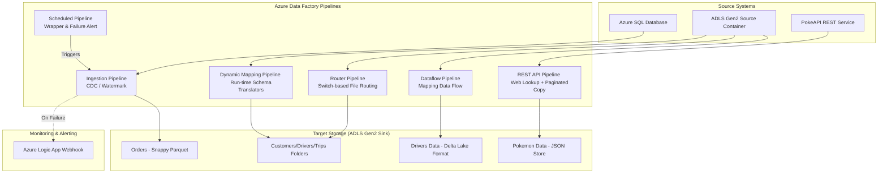

# Azure Data Factory (ADF) Data Integration Project

This repository contains a collection of production-grade Azure Data Factory (ADF) pipelines demonstrating advanced data integration patterns, metadata-driven ingestion, dynamic schema mapping, Change Data Capture (CDC), REST API pagination, and Mapping Data Flow transformations.

---

## 🚀 Key Patterns & Features

*   **Change Data Capture (CDC) / Incremental Load:** Watermark-based incremental ingestion from Azure SQL Database to Azure Data Lake Storage (ADLS) Gen2 in Snappy Parquet format, updating the watermark JSON checkpoint after every successful load.
*   **Metadata-Driven Routing:** Dynamically inspects incoming files and routes them to target directory structures based on file naming conventions using `Get Metadata`, `ForEach`, and `Switch` activities.
*   **Dynamic Schema Mapping:** Programmatic column translation/mapping at runtime based on the file type (`customers`, `drivers`, `trips`) using dynamic copy translators.
*   **REST API Pagination:** Dynamic pagination implementation using REST API sources with offset ranges derived from initial call outputs to ingest data in bulk.
*   **Mapping Data Flows (Delta Lake Sink):** ETL transformations (columns renaming, derived columns, concatenation) written to Delta format on ADLS Gen2.
*   **Automated Error Alerting:** Logic App HTTP webhooks integrated with execution triggers to send notifications on pipeline failure.

---

## 📐 Architecture & Data Flow Diagram



---

## 📁 Repository Structure

The factory resources are structured in their native ADF folders:
*   [**`/pipeline`**](./pipeline): Definitions for all orchestration workflows.
*   [**`/dataflow`**](./dataflow): Mapping Data Flow logic for row transformations and Delta writing.
*   [**`/dataset`**](./dataset): Reusable references to sources and sinks (JSON, CSV, Parquet, Azure SQL tables).
*   [**`/linkedService`**](./linkedService): Connection profiles (Azure SQL, REST APIs, ADLS Gen2).

---

## 🛠️ Pipeline Details

### 1. Ingestion Pipeline (`Ingestion.json`)
Performs incremental data loading (watermarking/CDC) from an Azure SQL Database to ADLS Gen2.
*   **Workflow:**
    1.  **Latest CDC (Lookup):** Reads the current watermark timestamp from a JSON file `cdc.json` (under `source/monitor/`).
    2.  **Count (Script):** Queries the Azure SQL database table to check if any records have a `last_updated` value newer than the watermark (or a `Backdate` parameter).
    3.  **If Condition:** Checks if `Total_Count > 0`.
    4.  **True Activities:**
        *   **Load (Copy):** Queries the newer records and copies them to ADLS Gen2 in Snappy Parquet format (`Parquet1` dataset).
        *   **Script1 (Script):** Queries the new maximum `last_updated` timestamp from the database table.
        *   **changeCDC (Copy):** Copies an empty template JSON (`empty.json`), appends the new `cdc_timestamp` as an additional column, and overwrites the watermark checkpoint (`cdc.json`).
*   **Parameters:**
    *   `Schema` (Default: `Source`)
    *   `Table` (Default: `Orders`)
    *   `Backdate` (Default: `2025-09-24`)

### 2. Scheduled Ingestion Orchestrator (`Scheduled.json`)
A parent/wrapper pipeline that schedules the ingestion and handles failures.
*   **Workflow:**
    1.  **Execute Pipeline (ExecutePipeline):** Invokes the `Ingestion` pipeline with standard runtime parameters.
    2.  **Alert (Web Activity):** If the sub-pipeline fails, this calls a Microsoft Logic App webhook to send a notification containing the failed pipeline name and run ID.

> [!NOTE]
> This pattern separates raw execution from operational monitoring, keeping the ingestion pipelines modular.

### 3. Dynamic Router (`Router.json`)
An automated, multi-file router that maps incoming flat files to their targeted domain folders in ADLS Gen2.
*   **Workflow:**
    1.  **Get Metadata:** Scans the `source/Files/` directory in the Datalake to list all child items.
    2.  **ForEach:** Loops through all retrieved file names concurrently.
    3.  **Switch:** Evaluates the prefix of the file name (using `@split(item().name,'.')[0]`).
        *   Case **`customers`** $\rightarrow$ Copies file to `sink/Customers/`
        *   Case **`drivers`** $\rightarrow$ Copies file to `sink/Drivers/`
        *   Case **`trips`** $\rightarrow$ Copies file to `sink/Trips/`

### 4. Dynamic Mapping (`Dynamic mapping with Schema.json`)
Similar to the router, but uses dynamic translation maps at runtime to handle structure mapping without hardcoding column conversions.
*   **Workflow:**
    1.  **Get Metadata:** Scans `source/Files/`.
    2.  **ForEach:** Iterates through files.
    3.  **Copy data1 (Copy):** Copies file to `sink/schema/` using a parameterized schema mapper mapping:
        ```json
        @if(
            equals(item().name,'customers.csv'), pipeline().parameters.customers,
            if(
                equals(item().name,'drivers.csv'), pipeline().parameters.drivers,
                pipeline().parameters.trips
            )
        )
        ```
*   **Parameters:** Configured with detailed JSON translation schemas (`customers`, `drivers`, `trips` mappings) to convert source columns to targeted schema fields dynamically.

### 5. Transform Mapping Data Flow (`Dataflow.json` & `/dataflow/dataflow.json`)
An ETL pipeline that leverages Spark execution environments in ADF to transform and structure data.
*   **Data Flow Transformations:**
    *   **Source:** Reads `drivers.csv` using the parameterized CSV dataset.
    *   **fullname (Derived Column):** Combines `first_name` and `last_name` into a single field: `Full_Name = concatWS(" ", first_name, last_name)`.
    *   **select (Select/Rename):** Renames fields to title-case (e.g., `Phone_number`, `Vehicle_id`) and drops raw name columns.
    *   **sink1 (Sink):** Writes output in Delta Lake format to the `sink/Dataflow/` container.

### 6. REST API Paginated Ingest (`REST API.json`)
Fetches and paginates REST API JSON data to a storage sink.
*   **Workflow:**
    1.  **Web1 (Web Activity):** Requests the endpoint `https://pokeapi.co/api/v2/pokemon` to determine the total record count.
    2.  **Copydatafrom_RestAPI (Copy):** Queries the REST source using an offset-based pagination rule:
        `RANGE: 0 : @{activity('Web1').output.COUNT}:20`
        Writes the concatenated output to a single JSON store file (`pokimon.JSON`) in ADLS Gen2.

## 📊 Key Dynamic Expressions & Formulas

To enable dynamic runtime operations, the pipelines utilize several ADF and Mapping Data Flow expressions:

### 1. Ingestion Watermark SQL Filter (`Ingestion.json`)
Filters source tables based on whether a custom backdate is supplied; otherwise, falls back to the logged CDC timestamp:
```sql
SELECT count(*) AS Total_Count FROM @{pipeline().parameters.Schema}.@{pipeline().parameters.Table} WHERE last_updated > 
    '@{-
        if(empty(pipeline().parameters.Backdate),
            activity('Latest CDC').output.value[0].cdc_timestamp,
            pipeline().parameters.Backdate)
    }'
```

### 2. Failure Alert JSON Body (`Scheduled.json`)
Constructs alert payloads dynamically to report run IDs and pipeline names to the Logic App webhook:
```json
{
    "Pipeline_Name": "@{pipeline().Pipeline}",
    "Pipeline_ID": "@{pipeline().RunId}"
}
```

### 3. Switch Router Condition (`Router.json`)
Extracts the prefix of file names before the extension to direct files to their target folders:
```json
@split(item().name, '.')[0]
```

### 4. Nested Conditional Translator Mapping (`Dynamic mapping with Schema.json`)
Evaluates the file name to assign the corresponding translation/mapping parameter dynamically:
```json
@if(
    equals(item().name, 'customers.csv'), pipeline().parameters.customers,
    if(
        equals(item().name, 'drivers.csv'), pipeline().parameters.drivers,
        pipeline().parameters.trips
    )
)
```

### 5. API Pagination Rule (`REST API.json`)
Determines the range offset dynamically based on the total count returned from the initial call:
```json
RANGE: 0 : @{activity('Web1').output.COUNT} : 20
```

### 6. Derived Full Name Expression (`dataflow.json`)
Concatenates raw names into a single clean string during the Spark transformation:
```json
Full_Name = concatWS(" ", first_name, last_name)
```

---

## 📂 Dataset Catalog

| Dataset Name | Type | Linked Service | Location (Container/Folder/Table) | Details / Parameters |
| :--- | :--- | :--- | :--- | :--- |
| **`AzureSqlTable1`** | Azure SQL Table | `LSdatabase` | Dynamically assigned via query | Used for querying source tables. |
| **`Parquet1`** | Parquet File | `Datalake` | `sink/Orders` | Writes data with snappy compression. |
| **`Dynamic_csv`** | CSV File | `Datalake` | Parameterized (`Container/Folder/File`) | Generic CSV reader/writer dataset. |
| **`RouterMetadata`** | CSV File | `Datalake` | `source/Files` | Used for directory scanning. |
| **`Json1`** | JSON File | `Datalake` | `source/monitor/cdc.json` | Holds the watermark timestamp. |
| **`Json2`** | JSON File | `Datalake` | `source/monitor/empty.json` | Template JSON for updating watermarks. |
| **`RestAPI`** | REST Resource | `RestService` | `?offset:{offset}` | REST endpoint for paginated data ingestion. |
| **`APIJSON`** | JSON File | `Datalake` | `sink/API/pokimon.JSON` | JSON target sink for REST API records. |

---

## 🔗 Linked Services Configuration

1.  **`Datalake`** (AzureBlobFS): Connects to ADLS Gen2 (`https://adfadvancestorageaccount.dfs.core.windows.net/`).
2.  **`LSdatabase`** (AzureSqlDatabase): Connects to Azure SQL Server `pavanlogin.database.windows.net`, Database `adfadvance` using SQL authentication.
3.  **`RestService`** (RestService): Connects to `https://pokeapi.co/api/v2/pokemon` (Anonymous authentication).

---

## 🚀 Setup & Execution Guide

### Prerequisites
1.  An **Azure Storage Account** with Hierarchical Namespace enabled (ADLS Gen2) containing:
    *   `source` container with folders `Files/` and `monitor/` (upload a baseline `cdc.json` and an empty `empty.json` in `monitor/`).
    *   `sink` container.
2.  An **Azure SQL Database** containing target tables (e.g. `Source.Orders`) with a `last_updated` column.
3.  An **Azure Logic App** HTTP trigger workflow configured to send emails/notifications upon receiving POST requests.

### Publishing Changes
This repository uses the config specified in `publish_config.json`:
```json
{"publishBranch":"adf_publish"}
```
Make changes in your feature branch, merge into the main branch, and click **Publish** in the ADF UI. ADF will generate ARM templates and push them to the `adf_publish` branch for CI/CD.